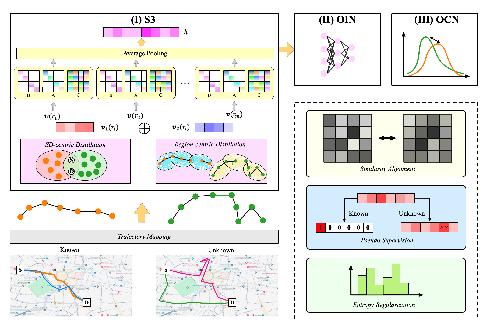
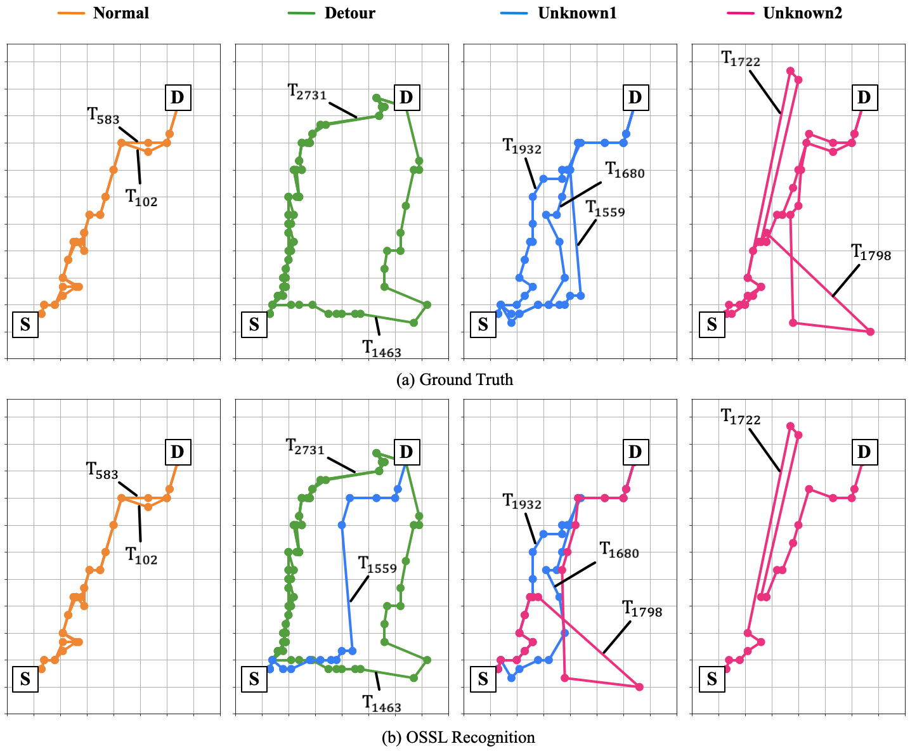

# Learning to Discover Anomalous Spatiotemporal Trajectory via Open-World State Space Model(OSSL)

## Introduction
This repository holds source code for the paper "Learning to Discover Anomalous Spatiotemporal Trajectory via Open-World State Space Model".
## Framework of OSSL

 
 
## Case Study of OSSL

 

## Datasets Description & Preprocessing
We conduct all experiments on two taxi trajectories datasets: Porto and Chengdu.
We have two folders:./data and ./embedding.To achieve processed data, you can follow this:
```
python data/porto/process.py
```
To obtain our egion Encoding with Semantics, you can follow this:
```
python embedding/poi_embedding_region.py
python embedding/poi_embedding_SD.py
```

## Running Procedures
For ATRO task, run ATRO_train.py:
```
python ATRO_train.py
```
For ATDO task, run ATDO_train.py:
```
python ATDO_train.py
```
